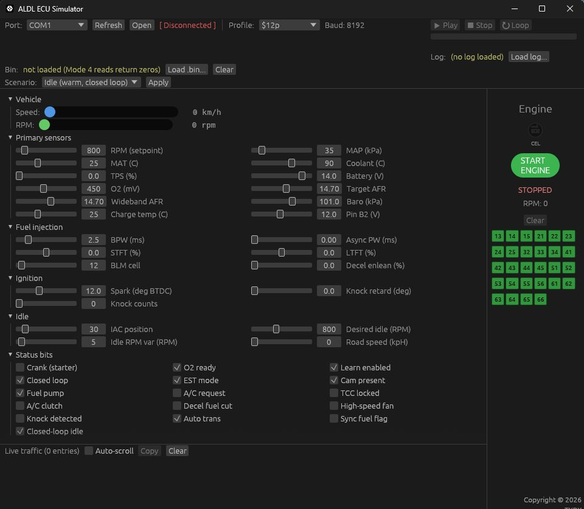

<p>
    
</p>

## What's in the bundle

- `ALDL_ECU_Simulator_GUI-<version>.exe` — GUI version (recommended)
- `ALDL_ECU_Simulator_cli-<version>.exe` — Command-line version
- `licence.txt` — MIT licence terms
- `README.txt` — this file's plain-text source

## Quick start

### GUI (recommended for first-time use)

1. Plug in a USB-to-serial adapter (FTDI, CH340, etc.)
2. Double-click `ALDL_ECU_Simulator_GUI-<version>.exe`
3. Pick the COM port from the dropdown
4. Click **Open**
5. Point TunerPro RT (or your scan tool) at the other end of the
   null-modem cable / adapter

### CLI (headless / automated)

```cmd
ALDL_ECU_Simulator_cli.exe --port COM3
ALDL_ECU_Simulator_cli.exe --port COM3 --rpm 2500 --clt 95
ALDL_ECU_Simulator_cli.exe /?          (show all options)
```

## Default values

| Parameter      | Value                            |
|----------------|----------------------------------|
| Baud rate      | 8192 (ALDL standard)             |
| Profile        | Commodore 3.8L V6                |
| Engine RPM     | 800 (idle)                       |
| Coolant        | 90 deg C                         |
| Intake air     | 25 deg C                         |
| Throttle       | 0%                               |
| Battery        | 14.0 V                           |

## Supported scan-tool commands

### Mode 1 (live data)

| Sub-id | Bytes | Description                          |
|--------|-------|--------------------------------------|
| `0x00` | 56    | Full petrol datastream               |
| `0x06` | 8     | Compact Message 6                    |
| `0x07` | 10    | Message 6 Dyno Modified (TPS, VE, CTS) |

### Mode 4 (diagnostic)

| Sub-id | Description                                              |
|--------|----------------------------------------------------------|
| `0x03` | Read memory block (returns bytes from a loaded `.bin`)  |
| `0x40` | Fuel pump on / off                                       |
| `0x02` | High-speed fan on / off                                   |
| `0x00` | TCC on, 20deg spark override, BLM reset, return to normal (distinguished by payload bytes) |

## Loading a calibration .bin (optional)

The simulator works without a `.bin` file (Mode 4 reads return zeros).
To test calibration reads:

1. Click **Load .bin...** in the GUI
2. Pick an OSE .bin file (32 KB)
3. Send a Mode 4 read command from the scan tool

## Troubleshooting

### COM port not in the dropdown
- Click **Refresh**
- Check the adapter is plugged in and the driver is installed
- Try a different USB port

### `Failed to open COMx` error
- Another program is using the port (close PuTTY, etc.)
- The port number is wrong (check Device Manager)

### Scan tool doesn't get a response
- Check the wiring (null-modem adapter between the two COM ports)
- Verify the baud rate matches (8192)
- Check the traffic tape in the GUI for incoming requests

## Licence

This software is released under the MIT Licence. See `licence.txt` for
the full text and third-party dependency attributions.
